# ERD Design — Classroom Equipment Management System (CEMS)
**Công nghệ:** ASP.NET MVC · C# · SQL Server  
**Phiên bản:** v1.2 (bổ sung PasswordResetToken)  
**Ngày:** 2026-06-23

> **Lưu ý phiên bản:** Đây là **Logical ERD** — kiểu dữ liệu được ghi ở mức logic (`String`, `Integer`, `Boolean`, `DateTime`, `Decimal`) thay vì kiểu vật lý DBMS cụ thể. Thông tin physical chi tiết sẽ được bổ sung ở tầng DDL/Physical Schema.

---

## 0. Generalization — Phân tầng User

Entity `User` đóng vai trò **Supertype** với 3 **Subtype** tương ứng 3 vai trò trong hệ thống. Chiến lược triển khai: **Single Table Inheritance** (1 bảng chung, phân biệt bằng trường `Role`).

```
         ┌─────────────┐
         │    User     │  ← Supertype
         │  (Supertype)│
         └──────┬──────┘
       (disjoint, total)
    ┌───────────┼───────────┐
    ▼           ▼           ▼
┌───────┐  ┌──────────┐  ┌──────────┐
│ Admin │  │Technician│  │ Lecturer │
└───────┘  └──────────┘  └──────────┘
```

- **Disjoint:** Một User chỉ thuộc đúng 1 vai trò tại một thời điểm.
- **Total participation:** Mọi User đều phải thuộc 1 trong 3 subtype (không có User "vô vai trò").
- Các thuộc tính chung (`UserCode`, `FullName`, `Email`...) nằm ở Supertype `User`.
- Hành vi đặc thù theo vai trò được kiểm soát ở tầng Application/Authorization.

---

## 1. Danh sách Entity và thuộc tính

> 📌 **Quy ước kiểu dữ liệu (Logical):**
> `String` · `Integer` · `Boolean` · `DateTime` · `Date` · `Decimal` · `Text`

### 1.1 User (Người dùng — Supertype)
> Đại diện cho tất cả tài khoản người dùng trong hệ thống. Là Supertype của Admin, Technician, Lecturer.

| Thuộc tính | Kiểu dữ liệu | Ràng buộc | Mô tả |
|---|---|---|---|
| **UserID** (PK) | Integer | NOT NULL, Auto-increment | Khóa chính tự tăng |
| UserCode | String | NOT NULL, UNIQUE | Mã định danh nội bộ (ví dụ: GV001, KT001) |
| FullName | String | NOT NULL | Họ và tên |
| Email | String | NOT NULL, UNIQUE | Email đăng nhập, duy nhất |
| PasswordHash | String | NOT NULL | Mật khẩu mã hóa (BCrypt) |
| PhoneNumber | String | NULL | Số điện thoại |
| AvatarUrl | String | NULL | Đường dẫn ảnh đại diện |
| Role | String | NOT NULL | Vai trò: Admin / Technician / Lecturer |
| IsActive | Boolean | NOT NULL, Default: true | Trạng thái tài khoản (Soft Delete) |
| CreatedAt | DateTime | NOT NULL, Default: now() | Ngày tạo tài khoản |
| UpdatedAt | DateTime | NULL | Ngày cập nhật gần nhất |
| LastLoginAt | DateTime | NULL | Lần đăng nhập cuối |
| FailedLoginCount | Integer | Default: 0 | Số lần đăng nhập sai liên tiếp |
| LockoutUntil | DateTime | NULL | Thời điểm hết khóa tài khoản |

---

### 1.2 Room (Phòng học)
> Danh mục các phòng học trong cơ sở.

| Thuộc tính | Kiểu dữ liệu | Ràng buộc | Mô tả |
|---|---|---|---|
| **RoomID** (PK) | Integer | NOT NULL, Auto-increment | Khóa chính |
| RoomCode | String | NOT NULL, UNIQUE | Mã phòng duy nhất (ví dụ: B101) |
| RoomName | String | NOT NULL | Tên phòng |
| Location | String | NULL | Vị trí/địa điểm (tòa nhà, tầng) |
| Capacity | Integer | NULL | Sức chứa (số người) |
| RoomType | String | NULL | Loại phòng: Lý thuyết / Thực hành / Hội trường |
| IsActive | Boolean | NOT NULL, Default: true | Còn sử dụng hay không |
| CreatedAt | DateTime | NOT NULL, Default: now() | Ngày tạo |

---

### 1.3 EquipmentCategory (Loại thiết bị)
> Danh mục phân loại thiết bị (máy chiếu, máy tính, điều hòa...).

| Thuộc tính | Kiểu dữ liệu | Ràng buộc | Mô tả |
|---|---|---|---|
| **CategoryID** (PK) | Integer | NOT NULL, Auto-increment | Khóa chính |
| CategoryName | String | NOT NULL, UNIQUE | Tên loại thiết bị, không trùng lặp |
| Description | Text | NULL | Mô tả chi tiết loại thiết bị |
| CreatedAt | DateTime | NOT NULL, Default: now() | Ngày tạo |

---

### 1.4 Equipment (Thiết bị)
> Thực thể trung tâm — từng cá thể thiết bị vật lý trong hệ thống.

| Thuộc tính | Kiểu dữ liệu | Ràng buộc | Mô tả |
|---|---|---|---|
| **EquipmentID** (PK) | Integer | NOT NULL, Auto-increment | Khóa chính |
| AssetCode | String | NOT NULL, UNIQUE | Mã định danh duy nhất toàn hệ thống |
| EquipmentName | String | NOT NULL | Tên thiết bị |
| **CategoryID** (FK) | Integer | NOT NULL, FK → EquipmentCategory | Thuộc loại thiết bị nào |
| **CurrentRoomID** (FK) | Integer | NULL, FK → Room | Phòng hiện tại (NULL = đang lưu kho) |
| SerialNumber | String | NULL | Số serial của nhà sản xuất |
| Manufacturer | String | NULL | Nhà sản xuất |
| Supplier | String | NULL | Nhà cung cấp |
| PurchaseDate | Date | NULL | Ngày mua |
| WarrantyExpiry | Date | NULL | Ngày hết bảo hành |
| Status | String | NOT NULL | Trạng thái: InUse / PendingRepair / UnderMaintenance / ProposedDisposal / Disposed |
| Notes | Text | NULL | Ghi chú thêm |
| **CreatedBy** (FK) | Integer | NOT NULL, FK → User | Người nhập kho (Technician) |
| **UpdatedBy** (FK) | Integer | NULL, FK → User | Technician cập nhật thông tin gần nhất |
| CreatedAt | DateTime | NOT NULL, Default: now() | Ngày nhập kho |
| UpdatedAt | DateTime | NULL | Ngày cập nhật cuối |

> **Business Rule:** `Status` chỉ được phép chuyển theo luồng hợp lệ:
> `InUse → PendingRepair → UnderMaintenance → ProposedDisposal → Disposed`

---

### 1.5 TransferHistory (Lịch sử điều chuyển phòng)
> Ghi lại mỗi lần thiết bị thay đổi vị trí phòng học. Read-only, không được xóa.

| Thuộc tính | Kiểu dữ liệu | Ràng buộc | Mô tả |
|---|---|---|---|
| **TransferID** (PK) | Integer | NOT NULL, Auto-increment | Khóa chính |
| **EquipmentID** (FK) | Integer | NOT NULL, FK → Equipment | Thiết bị nào được điều chuyển |
| **FromRoomID** (FK) | Integer | NULL, FK → Room | Phòng nguồn (NULL = từ kho) |
| **ToRoomID** (FK) | Integer | NOT NULL, FK → Room | Phòng đích |
| **TransferredBy** (FK) | Integer | NOT NULL, FK → User | Technician thực hiện |
| TransferDate | DateTime | NOT NULL, Default: now() | Thời gian điều chuyển |
| Reason | String | NULL | Lý do điều chuyển |

---

### 1.6 EquipmentStatusLog (Lịch sử thay đổi trạng thái thiết bị)
> Ghi lại **mỗi lần Technician cập nhật thông tin hoặc thay đổi trạng thái** của thiết bị. Read-only, không được xóa — đây là audit trail đầy đủ theo Business Rule số 5.

| Thuộc tính | Kiểu dữ liệu | Ràng buộc | Mô tả |
|---|---|---|---|
| **LogID** (PK) | Integer | NOT NULL, Auto-increment | Khóa chính |
| **EquipmentID** (FK) | Integer | NOT NULL, FK → Equipment | Thiết bị được thay đổi |
| **ChangedBy** (FK) | Integer | NOT NULL, FK → User | Technician thực hiện thay đổi |
| OldStatus | String | NULL | Trạng thái cũ (NULL = lần nhập kho đầu tiên) |
| NewStatus | String | NOT NULL | Trạng thái mới |
| FieldChanged | String | NULL | Tên trường được chỉnh sửa (nếu không phải đổi Status) |
| OldValue | String | NULL | Giá trị trước khi thay đổi |
| NewValue | String | NULL | Giá trị sau khi thay đổi |
| ChangeReason | String | NULL | Lý do thay đổi |
| ChangedAt | DateTime | NOT NULL, Default: now() | Thời điểm thay đổi |

> **Ghi chú:** Mỗi lần `Equipment` được UPDATE, application layer phải INSERT một record vào bảng này trước khi lưu thay đổi. Không ai được phép DELETE hoặc UPDATE bảng này.

---

### 1.7 IncidentReport (Báo cáo sự cố)
> Lưu mỗi lần Giảng viên gửi báo cáo hỏng thiết bị.

| Thuộc tính | Kiểu dữ liệu | Ràng buộc | Mô tả |
|---|---|---|---|
| **IncidentID** (PK) | Integer | NOT NULL, Auto-increment | Khóa chính |
| **EquipmentID** (FK) | Integer | NOT NULL, FK → Equipment | Thiết bị bị báo hỏng |
| **RoomID** (FK) | Integer | NOT NULL, FK → Room | Phòng xảy ra sự cố |
| **ReportedBy** (FK) | Integer | NOT NULL, FK → User | Giảng viên gửi báo cáo |
| **AssignedTo** (FK) | Integer | NULL, FK → User | Technician được phân công xử lý |
| Description | Text | NOT NULL | Mô tả sự cố |
| ImageUrl | String | NULL | Ảnh đính kèm |
| Status | String | NOT NULL, Default: 'Pending' | Trạng thái: Pending / InProgress / Resolved / Cancelled |
| ReportedAt | DateTime | NOT NULL, Default: now() | Thời gian báo cáo |
| ResolvedAt | DateTime | NULL | Thời gian đóng báo cáo |
| ResolutionNote | Text | NULL | Ghi chú kết quả xử lý |
| DueDate | DateTime | NULL | Hạn xử lý (Business Rule: 3-5 ngày làm việc) |
| IsOverdue | Boolean | Default: false | Đánh dấu quá hạn |

---

### 1.8 MaintenanceTicket (Phiếu bảo trì / sửa chữa)
> Được tạo khi thiết bị cần gửi ra đơn vị sửa chữa bên ngoài.

| Thuộc tính | Kiểu dữ liệu | Ràng buộc | Mô tả |
|---|---|---|---|
| **TicketID** (PK) | Integer | NOT NULL, Auto-increment | Khóa chính |
| **IncidentID** (FK) | Integer | NOT NULL, FK → IncidentReport | Phiếu xuất phát từ sự cố nào |
| **EquipmentID** (FK) | Integer | NOT NULL, FK → Equipment | Thiết bị đem đi bảo trì |
| **CreatedBy** (FK) | Integer | NOT NULL, FK → User | Technician lập phiếu |
| ServiceProvider | String | NOT NULL | Tên đơn vị nhận sửa |
| EstimatedCost | Decimal | NULL | Chi phí dự kiến |
| ActualCost | Decimal | NULL | Chi phí thực tế |
| SentDate | Date | NOT NULL | Ngày gửi máy |
| ExpectedReturnDate | Date | NOT NULL | Ngày dự kiến trả máy |
| ActualReturnDate | Date | NULL | Ngày thực tế trả máy |
| Status | String | NOT NULL | Trạng thái: Sent / Returned / Cancelled |
| Notes | Text | NULL | Ghi chú bổ sung |
| CreatedAt | DateTime | NOT NULL, Default: now() | Ngày lập phiếu |

---

### 1.9 DisposalRequest (Đề xuất thanh lý)
> Ghi nhận đề xuất thanh lý của Technician và quyết định của Admin.

| Thuộc tính | Kiểu dữ liệu | Ràng buộc | Mô tả |
|---|---|---|---|
| **DisposalID** (PK) | Integer | NOT NULL, Auto-increment | Khóa chính |
| **EquipmentID** (FK) | Integer | NOT NULL, FK → Equipment | Thiết bị đề xuất thanh lý |
| **ProposedBy** (FK) | Integer | NOT NULL, FK → User | Technician đề xuất |
| **ApprovedBy** (FK) | Integer | NULL, FK → User | Admin phê duyệt / từ chối |
| Reason | Text | NOT NULL | Lý do đề xuất thanh lý |
| Status | String | NOT NULL, Default: 'Pending' | Trạng thái: Pending / Approved / Rejected |
| ProposedAt | DateTime | NOT NULL, Default: now() | Ngày đề xuất |
| DecidedAt | DateTime | NULL | Ngày Admin quyết định |
| AdminNote | String | NULL | Ghi chú của Admin |

---

### 1.10 Notification (Thông báo)
> Lưu lịch sử tất cả thông báo được gửi đi trong hệ thống.

| Thuộc tính | Kiểu dữ liệu | Ràng buộc | Mô tả |
|---|---|---|---|
| **NotificationID** (PK) | Integer | NOT NULL, Auto-increment | Khóa chính |
| **RecipientID** (FK) | Integer | NOT NULL, FK → User | Người nhận thông báo |
| Title | String | NOT NULL | Tiêu đề thông báo |
| Message | Text | NOT NULL | Nội dung thông báo |
| Type | String | NOT NULL | Loại: IncidentReported / IncidentResolved / PasswordReset / WarrantyExpiry |
| IsRead | Boolean | Default: false | Đã đọc chưa |
| SentAt | DateTime | NOT NULL, Default: now() | Thời gian gửi |
| RelatedEntityType | String | NULL | Loại thực thể liên quan: Incident / Disposal / Equipment |
| RelatedEntityID | Integer | NULL | ID thực thể liên quan |

---

### 1.11 PasswordResetToken (Token đặt lại mật khẩu)
> Lưu token tạm thời khi người dùng thực hiện `UC_ForgotPassword`. Tự động hết hiệu lực sau 15 phút. Hỗ trợ Business Rule: giới hạn 3 lần yêu cầu / 24 giờ.

| Thuộc tính | Kiểu dữ liệu | Ràng buộc | Mô tả |
|---|---|---|---|
| **TokenID** (PK) | Integer | NOT NULL, Auto-increment | Khóa chính |
| **UserID** (FK) | Integer | NOT NULL, FK → User | Người dùng yêu cầu đặt lại mật khẩu |
| Token | String | NOT NULL, UNIQUE | GUID token ngẫu nhiên, duy nhất toàn hệ thống |
| ExpiresAt | DateTime | NOT NULL | Thời điểm hết hạn (CreatedAt + 15 phút) |
| IsUsed | Boolean | NOT NULL, Default: false | Đã sử dụng chưa |
| CreatedAt | DateTime | NOT NULL, Default: now() | Thời điểm tạo token |

> **Business Rules:**
> - `ExpiresAt = CreatedAt + 15 phút` — token chỉ hợp lệ trong 15 phút.
> - Mỗi lần tạo token mới, token cũ chưa dùng của user đó bị vô hiệu hóa (`IsUsed = true`).
> - Tối đa 3 yêu cầu / 24 giờ / user (kiểm tra qua Application layer).

---

## 2. Tổng hợp quan hệ (Relationships)

| Quan hệ | Từ | Đến | Loại | Participation | Ghi chú |
|---|---|---|---|---|---|
| R1 | User (Admin) | User | 1 — N | Partial | Một Admin tạo nhiều tài khoản |
| R2 | EquipmentCategory | Equipment | 1 — N | Total (Equipment) | Mọi thiết bị bắt buộc thuộc 1 loại |
| R3 | Room | Equipment | 1 — N | Partial | CurrentRoomID có thể NULL (đang ở kho) |
| R4 | Equipment | TransferHistory | 1 — N | Total (TransferHistory) | Mỗi log chuyển phòng bắt buộc có thiết bị |
| R5 | Room | TransferHistory (FromRoom) | 1 — N | Partial | FromRoom = NULL nếu xuất từ kho |
| R6 | Room | TransferHistory (ToRoom) | 1 — N | Total (TransferHistory) | ToRoom bắt buộc phải có |
| R7 | User (Technician) | TransferHistory | 1 — N | Total (TransferHistory) | Người thực hiện bắt buộc ghi nhận |
| R8 | Equipment | IncidentReport | 1 — N | Total (IncidentReport) | Báo cáo bắt buộc có thiết bị |
| R9 | Room | IncidentReport | 1 — N | Total (IncidentReport) | Báo cáo bắt buộc ghi phòng xảy ra |
| R10 | User (Lecturer) | IncidentReport | 1 — N | Total (IncidentReport) | Báo cáo bắt buộc có người gửi |
| R11 | User (Technician) | IncidentReport | 1 — N | Partial | AssignedTo có thể NULL lúc mới tạo |
| R12 | IncidentReport | MaintenanceTicket | 1 — 0..1 | Partial | Một sự cố tạo tối đa 1 phiếu bảo trì |
| R13 | Equipment | MaintenanceTicket | 1 — N | Total (MaintenanceTicket) | Phiếu bảo trì bắt buộc có thiết bị |
| R14 | User (Technician) | MaintenanceTicket | 1 — N | Total (MaintenanceTicket) | Phiếu bảo trì bắt buộc có người lập |
| R15 | Equipment | DisposalRequest | 1 — 0..1 | Partial | Tại 1 thời điểm, thiết bị chỉ có 1 đề xuất đang Pending |
| R16 | User (Technician) | DisposalRequest | 1 — N | Total (DisposalRequest) | Đề xuất bắt buộc có người đề xuất |
| R17 | User (Admin) | DisposalRequest | 1 — N | Partial | ApprovedBy NULL khi chưa Admin quyết định |
| R18 | User | Notification | 1 — N | Total (Notification) | Thông báo bắt buộc có người nhận |
| R19 | Equipment | EquipmentStatusLog | 1 — N | Total (EquipmentStatusLog) | Mỗi log bắt buộc gắn với thiết bị |
| R20 | User (Technician) | EquipmentStatusLog | 1 — N | Total (EquipmentStatusLog) | Mỗi log bắt buộc ghi người thực hiện |
| **R21** | **User** | **PasswordResetToken** | **1 — N** | **Total (PasswordResetToken)** | **Mỗi token bắt buộc thuộc 1 user** |

---

## 3. Referential Integrity — Hành vi xóa/cập nhật

> Ghi rõ hành vi khi entity cha bị xóa hoặc cập nhật PK, nhằm đảm bảo toàn vẹn tham chiếu.

| FK Nguồn | Trỏ đến | ON DELETE | ON UPDATE | Lý do |
|---|---|---|---|---|
| Equipment.CategoryID | EquipmentCategory | **RESTRICT** | CASCADE | Không cho xóa loại nếu còn thiết bị thuộc loại đó |
| Equipment.CurrentRoomID | Room | **SET NULL** | CASCADE | Thiết bị về kho (NULL) nếu phòng bị xóa (hiếm xảy ra) |
| Equipment.CreatedBy | User | **RESTRICT** | CASCADE | Không xóa tài khoản nếu còn thiết bị do họ tạo |
| Equipment.UpdatedBy | User | **SET NULL** | CASCADE | Cho phép NULL nếu tài khoản người cập nhật bị xóa |
| TransferHistory.EquipmentID | Equipment | **RESTRICT** | CASCADE | Không xóa thiết bị nếu còn lịch sử điều chuyển |
| TransferHistory.FromRoomID | Room | **SET NULL** | CASCADE | Lịch sử vẫn giữ, phòng nguồn thành NULL |
| TransferHistory.ToRoomID | Room | **RESTRICT** | CASCADE | Không xóa phòng nếu là đích trong lịch sử chuyển |
| TransferHistory.TransferredBy | User | **RESTRICT** | CASCADE | Audit trail: không xóa User có lịch sử điều chuyển |
| EquipmentStatusLog.EquipmentID | Equipment | **RESTRICT** | CASCADE | Audit trail: không xóa thiết bị có log thay đổi |
| EquipmentStatusLog.ChangedBy | User | **RESTRICT** | CASCADE | Audit trail: không xóa User có log thay đổi |
| IncidentReport.EquipmentID | Equipment | **RESTRICT** | CASCADE | Không xóa thiết bị đang có báo cáo |
| IncidentReport.RoomID | Room | **RESTRICT** | CASCADE | Không xóa phòng đang có báo cáo sự cố |
| IncidentReport.ReportedBy | User | **RESTRICT** | CASCADE | Audit: không xóa user có báo cáo |
| IncidentReport.AssignedTo | User | **SET NULL** | CASCADE | Bỏ phân công nếu Technician bị xóa |
| MaintenanceTicket.IncidentID | IncidentReport | **RESTRICT** | CASCADE | Phiếu bảo trì gắn với sự cố, không xóa sự cố có phiếu |
| MaintenanceTicket.EquipmentID | Equipment | **RESTRICT** | CASCADE | Không xóa thiết bị đang có phiếu bảo trì |
| MaintenanceTicket.CreatedBy | User | **RESTRICT** | CASCADE | Audit trail |
| DisposalRequest.EquipmentID | Equipment | **RESTRICT** | CASCADE | Không xóa thiết bị có đề xuất thanh lý |
| DisposalRequest.ProposedBy | User | **RESTRICT** | CASCADE | Audit trail |
| DisposalRequest.ApprovedBy | User | **SET NULL** | CASCADE | Nếu Admin bị xóa, ghi nhận NULL (đã phê duyệt rồi) |
| Notification.RecipientID | User | **CASCADE** | CASCADE | Xóa tài khoản → xóa luôn thông báo của họ |
| PasswordResetToken.UserID | User | **CASCADE** | CASCADE | Xóa user → xóa luôn các token của họ |

---

## 4. Sơ đồ ERD (dạng PlantUML)

```plantuml
@startuml CEMS_ERD
title Classroom Equipment Management System — Logical Entity Relationship Diagram v1.1

hide methods
hide stereotypes

skinparam class {
  BackgroundColor #F8F9FA
  BorderColor #495057
  HeaderBackgroundColor #343A40
  HeaderFontColor #FFFFFF
  FontSize 11
}

' ====== SUPERTYPE / SUBTYPE ======
entity User {
  * UserID : Integer <<PK>>
  --
  * UserCode : String <<UNIQUE>>
  * FullName : String
  * Email : String <<UNIQUE>>
  * PasswordHash : String
  PhoneNumber : String
  AvatarUrl : String
  * Role : String
  * IsActive : Boolean
  * CreatedAt : DateTime
  UpdatedAt : DateTime
  LastLoginAt : DateTime
  FailedLoginCount : Integer
  LockoutUntil : DateTime
}

entity Admin {
  (subtype of User, Role = Admin)
  --
  Quyền: Quản lý tài khoản, phòng,
  danh mục, phê duyệt thanh lý
}

entity Technician {
  (subtype of User, Role = Technician)
  --
  Quyền: Quản lý thiết bị, điều chuyển,
  xử lý sự cố, lập phiếu bảo trì
}

entity Lecturer {
  (subtype of User, Role = Lecturer)
  --
  Quyền: Xem thiết bị, gửi báo cáo sự cố
}

User <|-- Admin : "disjoint, total"
User <|-- Technician : "disjoint, total"
User <|-- Lecturer : "disjoint, total"

' ====== ENTITIES ======
entity Room {
  * RoomID : Integer <<PK>>
  --
  * RoomCode : String <<UNIQUE>>
  * RoomName : String
  Location : String
  Capacity : Integer
  RoomType : String
  * IsActive : Boolean
  * CreatedAt : DateTime
}

entity EquipmentCategory {
  * CategoryID : Integer <<PK>>
  --
  * CategoryName : String <<UNIQUE>>
  Description : Text
  * CreatedAt : DateTime
}

entity Equipment {
  * EquipmentID : Integer <<PK>>
  --
  * AssetCode : String <<UNIQUE>>
  * EquipmentName : String
  * CategoryID : Integer <<FK>>
  CurrentRoomID : Integer <<FK>>
  SerialNumber : String
  Manufacturer : String
  Supplier : String
  PurchaseDate : Date
  WarrantyExpiry : Date
  * Status : String
  Notes : Text
  * CreatedBy : Integer <<FK>>
  UpdatedBy : Integer <<FK>>
  * CreatedAt : DateTime
  UpdatedAt : DateTime
}

entity TransferHistory {
  * TransferID : Integer <<PK>>
  --
  * EquipmentID : Integer <<FK>>
  FromRoomID : Integer <<FK>>
  * ToRoomID : Integer <<FK>>
  * TransferredBy : Integer <<FK>>
  * TransferDate : DateTime
  Reason : String
}

entity EquipmentStatusLog {
  * LogID : Integer <<PK>>
  --
  * EquipmentID : Integer <<FK>>
  * ChangedBy : Integer <<FK>>
  OldStatus : String
  * NewStatus : String
  FieldChanged : String
  OldValue : String
  NewValue : String
  ChangeReason : String
  * ChangedAt : DateTime
}

entity IncidentReport {
  * IncidentID : Integer <<PK>>
  --
  * EquipmentID : Integer <<FK>>
  * RoomID : Integer <<FK>>
  * ReportedBy : Integer <<FK>>
  AssignedTo : Integer <<FK>>
  * Description : Text
  ImageUrl : String
  * Status : String
  * ReportedAt : DateTime
  ResolvedAt : DateTime
  ResolutionNote : Text
  DueDate : DateTime
  IsOverdue : Boolean
}

entity MaintenanceTicket {
  * TicketID : Integer <<PK>>
  --
  * IncidentID : Integer <<FK>>
  * EquipmentID : Integer <<FK>>
  * CreatedBy : Integer <<FK>>
  * ServiceProvider : String
  EstimatedCost : Decimal
  ActualCost : Decimal
  * SentDate : Date
  * ExpectedReturnDate : Date
  ActualReturnDate : Date
  * Status : String
  Notes : Text
  * CreatedAt : DateTime
}

entity DisposalRequest {
  * DisposalID : Integer <<PK>>
  --
  * EquipmentID : Integer <<FK>>
  * ProposedBy : Integer <<FK>>
  ApprovedBy : Integer <<FK>>
  * Reason : Text
  * Status : String
  * ProposedAt : DateTime
  DecidedAt : DateTime
  AdminNote : String
}

entity Notification {
  * NotificationID : Integer <<PK>>
  --
  * RecipientID : Integer <<FK>>
  * Title : String
  * Message : Text
  * Type : String
  * IsRead : Boolean
  * SentAt : DateTime
  RelatedEntityType : String
  RelatedEntityID : Integer
}

entity PasswordResetToken {
  * TokenID : Integer <<PK>>
  --
  * UserID : Integer <<FK>>
  * Token : String <<UNIQUE>>
  * ExpiresAt : DateTime
  * IsUsed : Boolean
  * CreatedAt : DateTime
}

' ====== RELATIONSHIPS ======
EquipmentCategory ||--o{ Equipment : "categorizes"
Room ||--o{ Equipment : "currentLocation"

Equipment ||--o{ TransferHistory : "hasTransfers"
Room ||--o{ TransferHistory : "fromRoom"
Room ||--o{ TransferHistory : "toRoom"
User ||--o{ TransferHistory : "performedBy"

Equipment ||--o{ IncidentReport : "reported"
Room ||--o{ IncidentReport : "locatedAt"
User ||--o{ IncidentReport : "reportedBy (Lecturer)"
User ||--o{ IncidentReport : "assignedTo (Technician)"

IncidentReport ||--o| MaintenanceTicket : "generates"
Equipment ||--o{ MaintenanceTicket : "maintained"
User ||--o{ MaintenanceTicket : "createdBy (Technician)"

Equipment ||--o| DisposalRequest : "proposedFor"
User ||--o{ DisposalRequest : "proposedBy (Technician)"
User ||--o{ DisposalRequest : "approvedBy (Admin)"

User ||--o{ Notification : "receives"

User ||--o{ Equipment : "createdBy"
User ||--o{ Equipment : "updatedBy"

Equipment ||--o{ EquipmentStatusLog : "hasStatusLogs"
User ||--o{ EquipmentStatusLog : "changedBy (Technician)"

User ||--o{ PasswordResetToken : "requestsReset"

@enduml
```



---

## 5. Legend — Bảng chú giải ký hiệu

### 5.1 Ký hiệu Cardinality (Crow's Foot Notation)

| Ký hiệu | Ý nghĩa | Ví dụ |
|---|---|---|
| `\|\|` | Đúng một (Exactly one) | Một IncidentReport có đúng 1 Equipment |
| `o\|` | Không hoặc một (Zero or one) | Một IncidentReport có 0 hoặc 1 MaintenanceTicket |
| `\|{` | Một hoặc nhiều (One or many) | Một Category có ít nhất 1 Equipment |
| `o{` | Không hoặc nhiều (Zero or many) | Một User có thể có 0 hoặc nhiều Notification |
| `\|o` | Zero or one (phía entity cha) | — |

### 5.2 Ký hiệu Participation

| Ký hiệu | Ý nghĩa |
|---|---|
| **Total participation** | Entity bắt buộc tham gia quan hệ (double line trong ER chuẩn) |
| **Partial participation** | Entity có thể không tham gia quan hệ (single line) |

### 5.3 Ký hiệu Kiểu dữ liệu Logical

| Kiểu Logical | Tương ứng Physical (SQL Server) |
|---|---|
| `Integer` | `INT` / `BIGINT` |
| `String` | `NVARCHAR(n)` |
| `Text` | `NVARCHAR(MAX)` / `NTEXT` |
| `Boolean` | `BIT` |
| `DateTime` | `DATETIME` / `DATETIME2` |
| `Date` | `DATE` |
| `Decimal` | `DECIMAL(18,2)` |

### 5.4 Ký hiệu đặc biệt trong bảng thuộc tính

| Ký hiệu | Ý nghĩa |
|---|---|
| **(PK)** | Primary Key — Khóa chính |
| **(FK)** | Foreign Key — Khóa ngoại |
| **UNIQUE** | Giá trị không được trùng lặp |
| **NOT NULL** | Bắt buộc có giá trị |
| **NULL** | Cho phép để trống |
| **Default: ...** | Giá trị mặc định |

---

## 6. Ghi chú thiết kế quan trọng

### 6.1 Chiến lược trạng thái thiết bị (Status State Machine)
```
InUse → PendingRepair → UnderMaintenance → ProposedDisposal → Disposed
  ↑___________↓ (sau khi sửa xong, trở về InUse)
```

### 6.2 Soft Delete
- `User.IsActive = false` → Tài khoản bị khóa, **không xóa vật lý** để giữ liên kết lịch sử.
- `Room.IsActive = false` → Phòng ngừng sử dụng, không xóa nếu còn thiết bị.

### 6.3 Audit Trail (Không bao giờ xóa)
- **TransferHistory**: Mọi lần chuyển phòng → ghi log vĩnh viễn.
- **EquipmentStatusLog**: Mọi lần cập nhật thông tin thiết bị → ghi log vĩnh viễn.
- **IncidentReport**: Mọi báo cáo sự cố → ghi log vĩnh viễn.
- **DisposalRequest**: Mọi đề xuất thanh lý → ghi log vĩnh viễn.

### 6.4 Business Rules phản ánh trong ERD

| Rule | Cách áp dụng |
|---|---|
| Mỗi thiết bị mã duy nhất | `AssetCode UNIQUE` |
| Tại 1 thời điểm, thiết bị ở 1 phòng | `Equipment.CurrentRoomID` là 1 FK duy nhất |
| Mọi thay đổi vị trí phải ghi log | Bảng `TransferHistory` bắt buộc |
| Mọi thay đổi thông tin thiết bị phải ghi log | Bảng `EquipmentStatusLog` + `UpdatedBy` |
| Chỉ Admin phê duyệt thanh lý | `DisposalRequest.ApprovedBy` → chỉ User có Role = Admin |
| Báo cáo đang Pending không tạo báo cáo mới | Ràng buộc tầng Application (logic) |
| Khóa tài khoản sau 5 lần sai | `FailedLoginCount`, `LockoutUntil` trong User |
| Nhắc bảo hành 30 ngày | `Equipment.WarrantyExpiry` → Background Job tự động kiểm tra |
| User buộc phải có vai trò | `Role NOT NULL`, disjoint total subtype |
